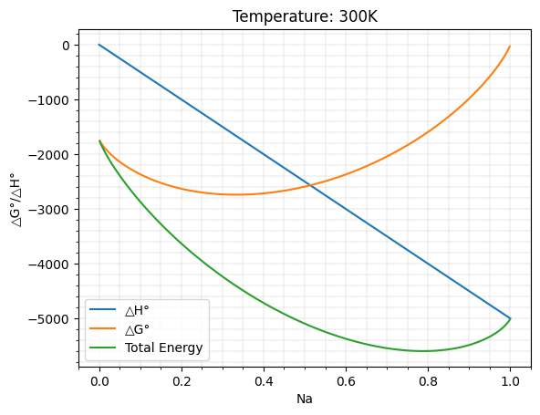
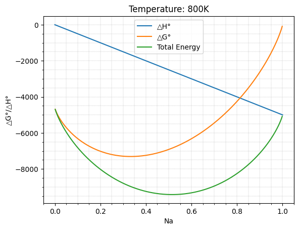
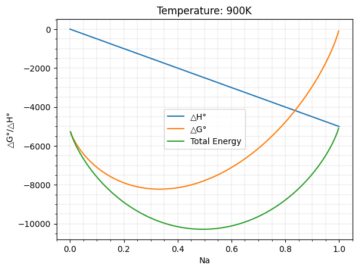

# Thermodynamic Graph Plotter

This script plots thermodynamic Gibbs free energy (ΔG), enthalpy (ΔH) as functions of the number of moles (Na).

## Prerequisites

- Python 3.x
- NumPy
- Matplotlib

## Installation

To install the required packages, run:

```bash
pip install numpy matplotlib jupyter
```

## Example Plots

Here are some example plots generated by the script:

|  |  |
|-------------------------------|-------------------------------|
|  |  |
|  |  |
|  |  |